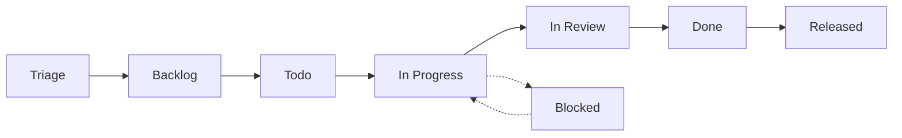
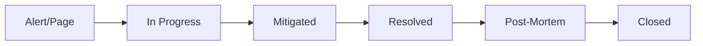
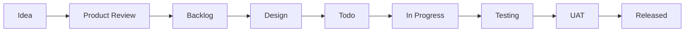
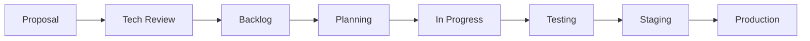
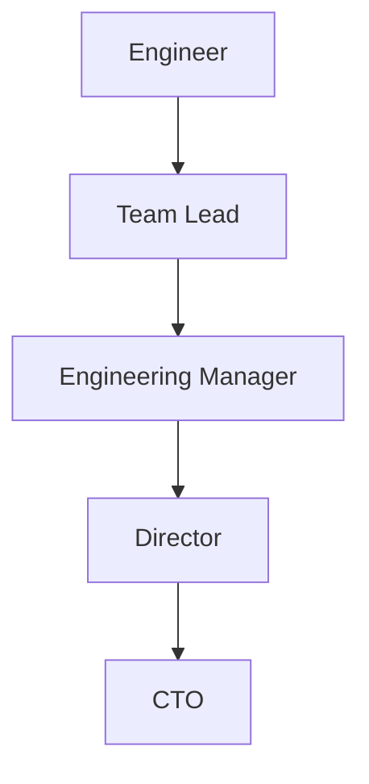

# Linear Workflows for DevOps Teams

## Overview
Workflows define how work moves from conception to production. This guide outlines optimal workflow configurations for DevOps teams based on Phoenix Project principles.

## Core Workflow States

### Standard DevOps Workflow



### State Definitions

| State | Purpose | WIP Limit | SLA |
|-------|---------|-----------|-----|
| **Triage** | Unprocessed incoming work | Unlimited | 24h |
| **Backlog** | Accepted, not scheduled | Unlimited | - |
| **Todo** | Scheduled for current cycle | Team capacity | - |
| **In Progress** | Actively being worked on | 1-2 per person | - |
| **In Review** | Code review, testing | 3-5 team total | 4h |
| **Blocked** | Waiting on dependency | Track carefully | 48h |
| **Done** | Complete, not deployed | Minimize | 24h |
| **Released** | Deployed to production | - | - |

## Work Type Specific Workflows

### 🚨 Incident Workflow (Unplanned Work)



**Special Rules:**
- Skip Triage and Backlog
- Auto-assign to on-call
- Start SLA timer immediately
- Require post-mortem for Critical/High

### 🎯 Feature Workflow (Business Work)



**Special Rules:**
- Require product approval
- Design review for UI changes
- UAT for customer-facing features
- Feature flag deployment

### 🔧 Infrastructure Workflow (Internal Work)



**Special Rules:**
- Require tech lead approval
- Mandatory staging deployment
- Change advisory board (CAB) for critical systems
- Rollback plan required

## WIP Limits and Flow

### Setting WIP Limits

```yaml
Team Size: 8 engineers

WIP Limits:
  In Progress: 
    - Max: 16 (2 per person)
    - Target: 12 (1.5 per person)
    - Warning: > 14
  
  In Review:
    - Max: 5
    - Target: 3
    - Warning: > 4
  
  Blocked:
    - Max: 3
    - Target: 0
    - Alert: > 1
```

### Visual Indicators

Configure Linear to highlight WIP violations:
- 🟢 Under limit (green)
- 🟡 Near limit (yellow)
- 🔴 Over limit (red)

## Automation Rules

### State Transition Automation

```javascript
// GitHub Integration
on('branch.created') => {
  moveToState('In Progress');
  assignToAuthor();
}

on('pull_request.opened') => {
  moveToState('In Review');
  notifyReviewers();
}

on('pull_request.merged') => {
  moveToState('Done');
  addComment('Merged to main');
}

on('deployment.success') => {
  moveToState('Released');
  notifyChannel('#releases');
}
```

### Blocked State Management

```javascript
// Auto-move to blocked
if (hasLabel('status/blocked')) {
  moveToState('Blocked');
  startEscalationTimer(48.hours);
}

// Auto-unblock
if (blockedDependency.resolved) {
  moveToState('In Progress');
  notifyAssignee();
  removeLabel('status/blocked');
}
```

### Stale Issue Management

```javascript
// Stale detection
if (state === 'In Progress' && 
    lastActivity > 3.days) {
  addLabel('status/stale');
  commentAsk('Is this still being worked on?');
}

if (state === 'In Review' && 
    lastActivity > 1.day) {
  pingReviewers();
  escalateToLead();
}
```

## Triage Process

### Daily Triage Meeting (15 minutes)

```markdown
## Agenda
1. Review all Triage items (5 min)
2. Classify and label (5 min)
3. Assign and route (5 min)

## Decision Matrix
For each issue:
- Is it urgent? → Skip to In Progress
- Is it clear? → Move to Backlog
- Need info? → Add status/needs-info
- Not relevant? → Close with reason
```

### Triage Criteria

| Criteria | Action | Next State |
|----------|--------|------------|
| Production down | Page on-call | In Progress |
| Customer reported | Set SLA | Backlog (High Priority) |
| Feature request | Product review | Product Backlog |
| Bug report | Reproduce first | Backlog or Needs Info |
| Internal improvement | Tech review | Tech Backlog |
| Documentation | Assign writer | Documentation Queue |

## Cycle Management

### Sprint Ceremonies

#### Sprint Planning (2 hours)
```yaml
Participants: Entire team
When: First Monday of sprint
Duration: 2 hours

Agenda:
  - Review previous sprint (15 min)
  - Present sprint goals (15 min)
  - Estimate and select work (60 min)
  - Identify risks/dependencies (20 min)
  - Commit to sprint (10 min)

Outputs:
  - Sprint backlog populated
  - All items in Todo state
  - Dependencies identified
  - Team commitment confirmed
```

#### Daily Standup (15 minutes)
```yaml
Participants: Core team
When: Daily at 10am
Duration: 15 minutes max

Format:
  - What I completed yesterday
  - What I'm working on today
  - Any blockers

Linear Views:
  - Filter: State = "In Progress" + Me
  - Filter: State = "Blocked"
  - Filter: Completed Yesterday
```

#### Sprint Review (1 hour)
```yaml
Participants: Team + Stakeholders
When: Last Friday of sprint
Duration: 1 hour

Agenda:
  - Demo completed features (30 min)
  - Review metrics (15 min)
  - Gather feedback (15 min)

Linear Reports:
  - Completed issues by type
  - Velocity trend
  - Cycle time analysis
```

## Escalation Paths

### Response Time SLAs

```yaml
Priority Levels:
  Critical:
    - Acknowledge: 15 minutes
    - First Response: 30 minutes
    - Resolution: 4 hours
    - Escalation: Immediate
  
  High:
    - Acknowledge: 1 hour
    - First Response: 2 hours
    - Resolution: 24 hours
    - Escalation: After 4 hours
  
  Medium:
    - Acknowledge: 4 hours
    - First Response: 8 hours
    - Resolution: 3 days
    - Escalation: After 1 day
  
  Low:
    - Acknowledge: 24 hours
    - First Response: 48 hours
    - Resolution: Best effort
    - Escalation: After 1 week
```

### Escalation Chain



## Custom Views for Workflow

### Team Dashboard Views

#### "My Current Work"
```yaml
Filters:
  - Assignee: Me
  - State: In Progress, Blocked
  - Cycle: Current
Sort: Priority DESC
Group: State
```

#### "Ready for Review"
```yaml
Filters:
  - State: In Review
  - Not Reviewed By: Me
Sort: Age DESC
Highlight: > 24 hours old
```

#### "Sprint Health"
```yaml
Filters:
  - Cycle: Current
Group: State
Show:
  - WIP limits
  - Velocity chart
  - Burndown
```

#### "Blocked Items"
```yaml
Filters:
  - State: Blocked
  - OR Label: status/blocked
Sort: Blocked Duration DESC
Alert: > 48 hours
```

## Workflow Metrics

### Key Flow Metrics

```yaml
Cycle Time:
  Target: < 3 days
  Measure: Todo → Released
  
Lead Time:
  Target: < 7 days
  Measure: Created → Released

Flow Efficiency:
  Target: > 40%
  Formula: Active Time / Total Time

WIP Adherence:
  Target: > 80%
  Formula: Days Under Limit / Total Days
```

### State Duration Targets

| State | Target Duration | Alert Threshold |
|-------|----------------|-----------------|
| Triage | < 24 hours | 48 hours |
| Todo | < 3 days | 5 days |
| In Progress | < 2 days | 3 days |
| In Review | < 4 hours | 24 hours |
| Blocked | < 48 hours | 72 hours |
| Done | < 24 hours | 48 hours |

## Anti-Patterns to Avoid

### ❌ Skipping States
**Problem**: Moving from Backlog directly to Done
**Impact**: Loses visibility, breaks metrics
**Solution**: Follow workflow, even for small changes

### ❌ Zombie Issues
**Problem**: Issues stuck in In Progress for weeks
**Impact**: False WIP, hidden blockers
**Solution**: Daily review, auto-escalation

### ❌ Review Bottleneck
**Problem**: Everything stuck in review
**Impact**: Slow delivery, context switching
**Solution**: Review SLA, dedicated review time

### ❌ Premature Moving
**Problem**: Moving to Done before tests pass
**Impact**: False completion, quality issues
**Solution**: Automated checks, clear criteria

## Implementation Guide

### Week 1: Basic Setup
- [ ] Configure workflow states
- [ ] Set up GitHub integration
- [ ] Define WIP limits
- [ ] Create basic views

### Week 2: Automation
- [ ] Configure auto-transitions
- [ ] Set up blocked detection
- [ ] Enable stale warnings
- [ ] Create SLA alerts

### Week 3: Process
- [ ] Run first triage meeting
- [ ] Implement daily standups
- [ ] Start tracking metrics
- [ ] Adjust WIP limits

### Week 4: Optimization
- [ ] Review bottlenecks
- [ ] Refine automation
- [ ] Customize views
- [ ] Document lessons learned

## Troubleshooting

### Common Issues

**Too Many Blocked Items**
- Review dependencies upfront
- Improve communication
- Consider smaller work items

**Review Bottleneck**
- Implement review rotation
- Set review time blocks
- Reduce PR size

**Unclear Requirements**
- Improve templates
- Require acceptance criteria
- Add definition of done

**Scope Creep**
- Lock requirements in Todo
- Require change requests
- Track changes separately

## Best Practices

1. **Visualize Everything**: Use board view for standups
2. **Limit WIP Religiously**: Better to finish than start
3. **Measure Flow**: Track cycle time weekly
4. **Automate Transitions**: Reduce manual updates
5. **Review Regularly**: Adjust based on metrics
6. **Document Decisions**: Keep workflow docs current

## Next Steps

1. Configure [AUTOMATION.md](./AUTOMATION.md) for workflow automation
2. Set up [METRICS.md](./METRICS.md) for flow metrics
3. Review [DAILY_OPERATIONS.md](./DAILY_OPERATIONS.md) for ceremonies
